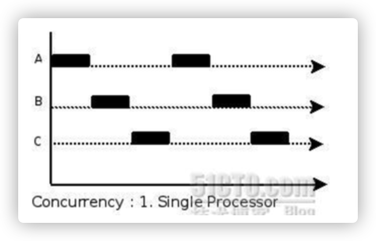

## 并发介绍

### 进程和线程

```
1.进程是程序在操作系统中的一次执行过程，系统进行资源分配和调度的一个独立单位
2.线程是进程的一个执行实体，是CPU调度和分派的基本单位，它是比进程更小的能独立运行的基本单位
3.一个进程可以创建和撤销多个进程，同一个进程中多个线程可以并发执行
```

### 并发和并行

```
1.多线程程序在一个核的CPU上运行，就是并发
2.多线程程序在多个核的CPU上运行，就是并行
```

#### 并发



#### 并行


### 协程和线程

```
协程：独立的栈空间，共享堆空间，调用由用户自己控制，本质上优点类似于用户级线程，这些用户用户级线程的调度也是自己实现
线程：一个线程上可以跑多个协程，协程是轻量级的线程
```

### goroutine只是由官方实现的超级线程池

```
每个实例拥有 4-5k 的栈内存占用和由于实现机制而大幅减少的创建和销毁开销是go高并发的根本原因
```

### 并发不是并行

```
并发主要由切换时间片来实现”同时”运行，并行则是直接利用多核实现多线程的运行，go可以设置使用核数，以发挥多核计算机的能力
```

## goroutine 

> goroutine奉行通过通信来共享内存，而不是共享内存来通信

```
调用函数的时候在前面加上go关键字，就可以位一个函数创建一个goroutine
```

### 启动单个goroutine 

```
	只需要在调用的函数前面加上一个go关键字
```

### 启动多个goroutine 

```go
var wg sync.WaitGroup

func hello(i int) {
    defer wg.Done() // goroutine结束就登记-1
    fmt.Println("Hello Goroutine!", i)
}
func main() {

    for i := 0; i < 10; i++ {
        wg.Add(1) // 启动一个goroutine就登记+1
        go hello(i)
    }
    wg.Wait() // 等待所有登记的goroutine都结束
}
// 主协程退出，其他的任务不会继续执行
```

### goroutine 和线程

#### 可增长的栈

```
	OS线程一般都有固定的栈大小，一个goroutine的栈在其生命周期开始时只有很小的栈，可以按需增大和缩小
```

#### goroutine 调度

```
GPM是go语言运行时层面的实现，是go语言自己实现的一套调度系统。
1.G是一个goroutine，里面除了存放goroutine信息外，还有与所在P的绑定等信息
2.P管理着一组goroutine队列，P里面会存放着当前goroutine运行的上下文环境，P会对自己管理的goroutine队列做一些调度，当自己的队列消费完成后就去其他队列P的队列里抢任务，如果没有则去全局队列拿任务
3.M是Go运行时对操作系统内核线程的虚拟，M约内核线程一般是一对一的映射关系，一个goroutine最后要放到m上执行
```

## runtime包

### runtime.Gosched()

> 让出当前的CPU时间片，重新安排任务执行

### runtime.Goexit()

> 退出当前协程

### runtime.GOMAXPROCS()

> go运行时的调度器使用GOMAXPROCS参数来确定需要使用多少OS线程同时执行Go代码，默认是机器上的CPU核心数。

## channel

​	go语言的并发模型是CSP，提倡通过通信共享内存而不是用过共享内存实现通信。

​	channel是一种特殊的类型，就像一个队列，准讯先进先出规则，保证收发数据的顺序。

### channel类型

```
channel是一种类型，引用类型

var 变量 chan 元素类型
```

### 创建channel

```
通道是引用类型，通道类型的空值是nil
使用make进行初始化

ch := make(chan int)
```

### channel操作

```
通道由发送、接收和关闭三种操作
发送和接收都用<-符号

ch := make(chan int)
// 发送
ch <- 10
// 接收
x := <- ch
<- ch // 忽略值
// 关闭
cloese(ch)

关闭后的通道的特点：
1.对一个关闭的通道再发值会导致panic
2.对一个关闭的通道接收会一直获取到取值知道通道位为空
3.对一个关闭的并且没有值的通道执行接收操作会得到对应类型的零值
4.关闭一个已经关闭的通道会panic
```

### 无缓冲的通道

```
无缓冲的通道又称为阻塞的通道，

func main() {
    ch := make(chan int)
    ch <- 10
    fmt.Println("发送成功")
}   
// 会出现deadlock
```

### 有缓冲的通道

```
使用make函数初始化的通道的时候为其制定通道的容量

func main() {
	ch := make(chan int, 1)
	ch <- 10
	fmt.Println("发送成功")
}

len()
cap()
```

### close()

```
使用内置的close()函数关闭channel
```

### 单向通道

```
1.chan<- int是只发送
2.<-chan int是只接收
```

## goroutine池

```
wooker pool 
1.本质上是生产者消费者模型
2.可以有效控制goroutine树立那个，防止暴涨
```

## 定时器

### Timer

> 时间到了，执行一次

```
timer := time.NewTimer(time.Second)

// 等待
<-timer.C
// 停止
timer.Stop()
// 重置
timer.Reset(time.Second)

// 等待
time.After(time.Second)
```

### Ticker

> 时间到了，执行数次

```
ticker := time.NewTicker(time.Second * 2)
<-ticker.C
```

## select

```
select类似switch语句，它有一系列的case分支和一个默认的分支，每个case会对应一个通道的通信过程，select会一直等待知道某个case的通信操作完成，就会执行case分支对应的语句

select {
	case <-chan1:
	case chan2<-1:
	default:
}
```

## 并发安全和锁

> 有时候Go代码中可能存在多个goroutine同时操作一个资源（临界区），这种情况会发生竟态问题

### 互斥锁

```
互斥锁是一种常用的控制共享资源访问的方法，它能保证只有一个goroutine可以访问资源，使用sync包下的mutex实现

使用互斥锁能够保证同一时间有且只有一个goroutine进入临界区，其他的goroutine则在等待锁；当互斥锁释放后，等待的goroutine才可以获取锁进入临界区，多个goroutine同时等待一个锁时，唤醒的策略是随机的
```

### 读写互斥锁

```
	读锁：当一个goroutine获取读锁之后，其他的goroutine如果是获取读锁会继续获得锁，如果是获取写锁就会等待

	写锁：当一个goroutine获取写锁之后，其他的goroutine无论是获取读锁还是写锁都会等待
```

