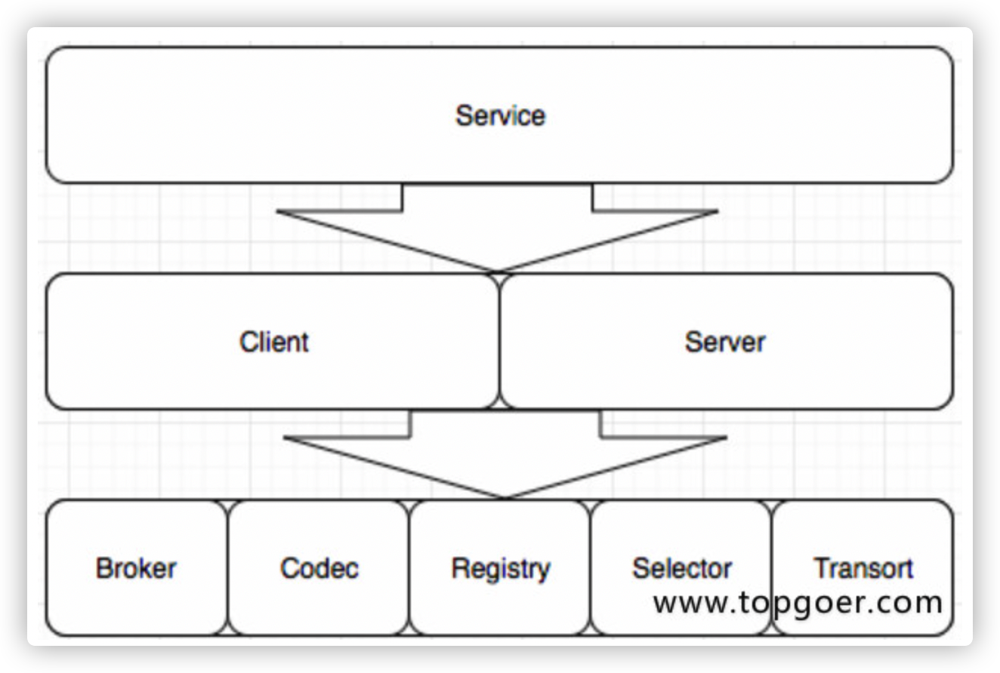

Go写RPC程序需要符合4个条件

- 结构体字段首字母要大写
- 函数名必须首字母大写
- 函数第一参数是接受参数，第二参数是返回客户端的参数，必须是指针类型
- 函数还必须有一个返回值error


## raft

> Raft提供一种计算系统集群中分布状态机的通用方法，确保集群中的每一个节点都同意一系列的状态转换
>
> 一个Raft集群包含若干个服务器节点，通常是5个，它将允许整个系统容忍2个节点是失效
>
> 节点的状态有：follower, candidate, leader

### Raft一致性算法

- Raft通过筛选一个leader来简化日志副本的管理，日志项只循序从leader流向follower
- Raft算法可以分解为三个问题，领导选举，日志复制，安全性 


#### 领导选举

- Raft使用心跳机制来出发领导人选举
- 当服务器其中时，节点都是follower身份
- 如果一个follower在一段时间都没有收到任何消息，出现选举超时，它就会认为系统没有可用的leader然后开始进行选举
- 要进行一次选举，follower会给当前term加1转为candidate状态，然后它会并行的向集群中的其他服务器节点发送请求投票的节点来给自己投票
- 候选人的状态维持直到发生以下任何一个条件发生的时候
  - 他自己赢得了这次的选举
  - 其他的服务器成为领导者
  - 一段时间之后没有任何一个获胜的人

#### 日志复制

- 当选出leader后，它会开始接收客户端的请求，每个请求都会带一个指令，可以被放回到状态机中
- leader把指令追加一个log entry，然后通过AppendEntries RPC并行地发送给其他的节点，当该entry被多数server复制后，leader会把该entry放回状态机，然后把结果返给客户端
- 当follower宕机或运行缓慢，leader会无限重发AppendEntries给这些follower，直到所有的follower都复制了该log entry
- raft的log replication要保证如果两个log entry有想用的index喝term，那么他们存储相同的指令
- leader在一个特定的term和index下，只会创建一个log entry

## gRPC

- gRPC是Google开发的，语言中立，平台中立，开源的远程过程调用系统
- gRPC客户端和服务端可以在多种环境下运行和交互

### rpc的特征

- 强大的IDL，使用protobuf定义服务
- 多语言支持
- 基于http2

### protobuf语法

- 文件以.proto作为文件后缀，除结构定义外的语句以分号结尾

- 结构定义：message, service, enum

- rpc方法定义结尾的分号可有可无

- message命名采用驼峰命名方式，字段名采用小写字符加下划线分隔

  ```protobuf
  message SongServerRequest{
  	required string song_name = 1;
  }
  ```

- enum类型名采用驼峰命名方式，字段命名采用大写字母方式加下划线分隔方式

  ```protobuf
  enum Foo {
  	FIRST_VALUE = 1;
  	SECOND_VALUE = 2;
  }
  ```

- service和rpc方法名称统一采用驼峰命名

#### 字段规则

- 字段格式：限定修饰符｜数据类型｜字段名称｜ = ｜字段编码值｜[字段默认值]

- 限定修饰符包含：required, optional, repeated
  - Required， 表示为一个必须字段
  - optional， 可选字段
  - repeated， 表示字段可以包含0～N个元素
- 数据类型

| .proto   | C++    | Java       | Python         | Go      | Ruby                 | C#         |
| :------- | :----- | :--------- | :------------- | :------ | :------------------- | :--------- |
| double   | double | double     | float          | float64 | Float                | double     |
| float    | float  | float      | float          | float32 | Float                | float      |
| int32    | int32  | int        | int            | int32   | Fixnum or Bignum     | int        |
| int64    | int64  | long       | ing/long[3]    | int64   | Bignum               | long       |
| uint32   | uint32 | int[1]     | int/long[3]    | uint32  | Fixnum or Bignum     | uint       |
| uint64   | uint64 | long[1]    | int/long[3]    | uint64  | Bignum               | ulong      |
| sint32   | int32  | int        | intj           | int32   | Fixnum or Bignum     | int        |
| sint64   | int64  | long       | int/long[3]    | int64   | Bignum               | long       |
| fixed32  | uint32 | int[1]     | int            | uint32  | Fixnum or Bignum     | uint       |
| fixed64  | uint64 | long[1]    | int/long[3]    | uint64  | Bignum               | ulong      |
| sfixed32 | int32  | int        | int            | int32   | Fixnum or Bignum     | int        |
| sfixed64 | int64  | long       | int/long[3]    | int64   | Bignum               | long       |
| bool     | bool   | boolean    | boolean        | bool    | TrueClass/FalseClass | bool       |
| string   | string | String     | str/unicode[4] | string  | String(UTF-8)        | string     |
| bytes    | string | ByteString | str            | []byte  | String(ASCII-8BIT)   | ByteString |

- 字段名称，使用下划线分隔的驼峰式
- 字段编码值，用于通信双方识别对方的字段，相同的编码值，其界定修饰符和数据类型必须相同
- 字段默认值，当在传递数据时，对于required数据类型，如果用户没有设置值，则使用默认值传递到对端

```protobuf
syntax = "proto3";
package proto;
option go_package = "./proto";

service SearchService {
  rpc Search (SearchRequest) returns (SearchResponse) {}
}

// SearchRequest 搜索请求
message SearchRequest {
  string query = 1;            // 查询字符串
  int32  page_number = 2;     // 页码
  int32  result_per_page = 3;   // 每页条数
}

// SearchResponse 搜索响应
message SearchResponse {
  repeated Result results = 1;
}

message Result {
  string url = 1;
  string title = 2;
  repeated string snippets = 3;
}

// protoc --go_out=. proto/test.proto   
```

## Go Micro

### 主要功能

- 服务发现：自动服务注册和名称解析。服务发现是微服务开发的核心。当服务A需要与服务B通话时，它需要该服务的位置。默认发现机制是多播DNS（mdns），一种零配置系统。您可以选择使用SWIM协议为p2p网络设置八卦，或者为弹性云原生设置设置consul
- 负载均衡：基于服务发现构建的客户端负载均衡。一旦我们获得了服务的任意数量实例的地址，我们现在需要一种方法来决定要路由到哪个节点。我们使用随机散列负载均衡来提供跨服务的均匀分布，并在出现问题时重试不同的节点
- 消息编码：基于内容类型的动态消息编码。客户端和服务器将使用编解码器和内容类型为您无缝编码和解码Go类型。可以编码任何种类的消息并从不同的客户端发送。客户端和服务器默认处理此问题。这包括默认的protobuf和json
- 请求/响应：基于RPC的请求/响应，支持双向流。我们提供了同步通信的抽象。对服务的请求将自动解决，负载平衡，拨号和流式传输。启用tls时，默认传输为http / 1.1或http2
- Async Messaging：PubSub是异步通信和事件驱动架构的一流公民。事件通知是微服务开发的核心模式。启用tls时，默认消息传递是点对点http / 1.1或http2
- 可插拔接口：Go Micro为每个分布式系统抽象使用Go接口，因此，这些接口是可插拔的，并允许Go Micro与运行时无关，可以插入任何基础技术
  - 插件地址：https://github.com/micro/go-plugins

### go-micro通信流程

- Server监听客户端的调用，和Brocker推送过来的信息进行处理。并且Server端需要向Register注册自己的存在或消亡，这样Client才能知道自己的状态
- Register服务的注册的发现，Client端从Register中得到Server的信息，然后每次调用都根据算法选择一个的Server进行通信，当然通信是要经过编码/解码，选择传输协议等一系列过程的
- 如果有需要通知所有的Server端可以使用Brocker进行信息的推送，Brocker 信息队列进行信息的接收和发布

### go-micro核心接口

- go-micro之所以可以高度订制和他的框架结构是分不开的，go-micro由8个关键的interface组成，每一个interface都可以根据自己的需求重新实现，这8个主要的inteface也构成了go-micro的框架结构



### Transort通信接口

通信相关接口

```go
type Socket interface {
   Recv(*Message) error
   Send(*Message) error
   Close() error
}

type Client interface {
   Socket
}

type Listener interface {
   Addr() string
   Close() error
   Accept(func(Socket)) error
}

type Transport interface {
   Dial(addr string, opts ...DialOption) (Client, error)
   Listen(addr string, opts ...ListenOption) (Listener, error)
   String() string
}
```

### Codec编码接口

编解码，底层也是protobuf

```go
type Codec interface {
   ReadHeader(*Message, MessageType) error
   ReadBody(interface{}) error
   Write(*Message, interface{}) error
   Close() error
   String() string
}
```

### Registry注册接口

服务注册发现的实现：etcd、consul、mdns、kube-DNS、zk

```go
type Registry interface {
   Register(*Service, ...RegisterOption) error
   Deregister(*Service) error
   GetService(string) ([]*Service, error)
   ListServices() ([]*Service, error)
   Watch(...WatchOption) (Watcher, error)
   String() string
   Options() Options
}
```

### Selector负载均衡

根据不同算法请求主机列表

```go
type Selector interface {
   Init(opts ...Option) error
   Options() Options
   // Select returns a function which should return the next node
   Select(service string, opts ...SelectOption) (Next, error)
   // Mark sets the success/error against a node
   Mark(service string, node *registry.Node, err error)
   // Reset returns state back to zero for a service
   Reset(service string)
   // Close renders the selector unusable
   Close() error
   // Name of the selector
   String() string
}
```

### Broker发布订阅接口

pull push watch

```go
type Broker interface {
   Options() Options
   Address() string
   Connect() error
   Disconnect() error
   Init(...Option) error
   Publish(string, *Message, ...PublishOption) error
   Subscribe(string, Handler, ...SubscribeOption) (Subscriber, error)
   String() string
}
```

### Client客户端接口

```go
type Client interface {
   Init(...Option) error
   Options() Options
   NewMessage(topic string, msg interface{}, opts ...MessageOption) Message
   NewRequest(service, method string, req interface{}, reqOpts ...RequestOption) Request
   Call(ctx context.Context, req Request, rsp interface{}, opts ...CallOption) error
   Stream(ctx context.Context, req Request, opts ...CallOption) (Stream, error)
   Publish(ctx context.Context, msg Message, opts ...PublishOption) error
   String() string
}
```

### Server服务端接口

```go
type Server interface {
   Options() Options
   Init(...Option) error
   Handle(Handler) error
   NewHandler(interface{}, ...HandlerOption) Handler
   NewSubscriber(string, interface{}, ...SubscriberOption) Subscriber
   Subscribe(Subscriber) error
   Register() error
   Deregister() error
   Start() error
   Stop() error
   String() string
}
```

### Serveice接口

```go
type Service interface {
   Init(...Option)
   Options() Options
   Client() client.Client
   Server() server.Server
   Run() error
   String() string
}
```