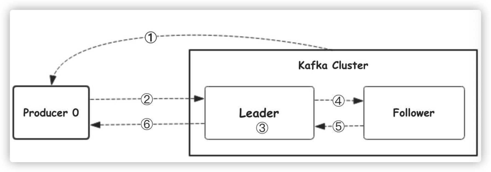

## 操作mysql

```go
go get github.com/go-sql-driver/mysql 
go get github.com/jmoiron/sqlx   

// 连接
sqlx.Open("mysql", "root:123456@tcp(127.0.0.1:3306)/test")

// 插入
db.Exec("insert into person(username, sex, email)values(?, ?, ?)", "test1", "1", "test@qq.com")

// 查询
var person []Person
db.Select(&person, "select user_id, username, sex, email from person where user_id=?", 1)

// 更新
db.Exec("update person set username=? where user_id=?", "unminzzz", 1)

// 删除
db.Exec("delete from person where user_id=?", 1)

// 事务
db.Begin()
db.Commit()
db.Rollback()
```

## 操作redis

```go
go get github.com/gomodule/redigo/redis

// 连接
redis.Dial("tcp", "127.0.0.1:6379")

// get set string
conn.Do("set", "test", 100)
redis.Int(conn.Do("get", "test"))

conn.Do("setex", "test_string_expire", 60, "1")
redis.Int(conn.Do("ttl", "test_string_expire"))
redis.String(conn.Do("get", "test_string_expire"))

// set get strings
conn.Do("mset", "a", 100, "b", 200)
redis.Ints(conn.Do("mget", "a", "b"))

// expire
conn.Do("expire", "a", 10)

// list
conn.Do("lpush", "test_list", "a", "b", "c")
redis.String(conn.Do("lpop", "test_list"))
// c

// hash
conn.Do("hset", "test_hash", "abc", 100)
redis.Int(conn.Do("hget", "test_hash", "abc"))

// 命令参考
https://www.redis.net.cn/order/
```

```go
var pool *redis.Pool
pool = &redis.Pool{
	MaxIdle: 16,
	MaxActive: 1000,
  MaxActive:   0,
	IdleTimeout: 30,
	Dial: func() (redis.Conn, error) {
		return redis.Dial("tcp", "127.0.0.1:6379")
	},
}
```

## 操作etcd

```
	etcd是一个使用go语言开发的开源、高可用的分布式kv存储系统，可用于配制共享和服务的注册发现。
	etcd的特点：
	1. 完全复制，即群众的每个节点都可以使用完整的存档
	2. 高可用性，etcd可用于避免硬件的单点故障和网络问题
	3. 一致性，每次读取都会返回跨多主机的最新写入
	4. 简单，包含了一个定义良好、面向用户的API(gRPC)
	5. 安全，实现了带有可选的客户端证书验证的自动化TLS
	6. 快速，没秒10000次写入的基准速度
	7. 可靠，使用Raft算法实现了强一致性、高可用的服务存储目录
	
	etcd的应用场景
	1. 服务发现
	2. 配置中心
	3. 分布式锁，锁服务有两种方式，保持占用和控制时序，
```

```go
go get go.etcd.io/etcd/client/v3

// conn
client.New(clientv3.Config{
	Endpoints: []string{"127.0.0.1:2379"},
	DialTimeout: 5 * time.Second,
})

// put
ctx, cancel := context.WithTimeout(context.Background(), time.Second)
cancel()
client.Put(ctx, "test_put", "hava_value_now")


// get
ctx, cancel := context.WithTimeout(context.Background(), time.Second)
cancel()
resp, _ := client.Get(ctx, "test_put")
for _, ev := range resp.Keys {
	// ev.Keys
	// ev.Value
}

// watch
// <-chan 
rchan := client.Watch(context.Backgroud(), "test_watch")
for wrsp := range rchan {
  for _, ev := range wrsp.Events {
    // ev.Type
    // ev.Kv.Key
    // ev.Kv.Value
  }
}

// lease租约
resp, _ := client.Grant(context.TODO(), 5)
client.Put(context.TODO(), "test_lease", "have_value_now", clientv3.WithLease(resp.ID))

// keepAlive
resp, _ := client.Grant(context.TODO(), 5)
client.Put(context.TODO(), "test_lease", "have_value_now", clientv3.WithLease(resp.ID))
ch, _ := cli.KeepAlive(context.TODO(), resp.ID)
for {
	ka := <-ch
  fmt.Println("ttl:", ka.TTL)
}


// 基于etcd实现分布式锁
s1, _ := concurrency.NewSession(client)
defer s1.Close()
m1 := concurrency.NewMutex(s1, "/my-lock/")

s2, _ := concurrency.NewSession(client)
defer s2.Close()
m2 := concurrency.NewMutex(s2, "/my-lock/")

m1.Lock(context.TODO())
canLock := make(chan struct{})
go func() {
  // 关闭无缓冲通道，下面直接读不阻塞
  defer close(canLock)
  m2.Lock()
}
m1.UnLock(context.TODO())
<-canLock
```

## zookeeper

```go
// conn
zk.Connect([]string{"127.0.0.1:2181"}, time.Second*3)

// create
var flags int32 = 0
//flags有4种取值：
//0:永久，除非手动删除
//zk.FlagEphemeral = 1:短暂，session断开则改节点也被删除
//zk.FlagSequence  = 2:会自动在节点后面添加序号
//3 即，短暂且自动添加序号
conn.Create("/test_create", nil, flags, zk.WorldACL(zk.PermAll))
conn.Set("/test_create", nil, -1)
conn.Delete("/test_create", -1)
conn.Children("/")
```

```go
func main() {
	go startServer("127.0.0.1:18897")
	go startServer("127.0.0.1:18898")
	go startServer("127.0.0.1:18899")

	a := make(chan struct{})
	<-a
}

func startServer(url string) {
	listener, err := net.Listen("tcp", url)
	handleServerError(err, "listen tcp err: ")
	zkList := []string{"localhost:2181"}
	zkConn, _, err := zk.Connect(zkList, 10*time.Second)
	handleServerError(err, "conn zk err: ")
	defer zkConn.Close()
	zkConn.Create("/servers", nil, 0, zk.WorldACL(zk.PermAll))
	_, err = zkConn.Create("/servers/"+url, nil, zk.FlagEphemeral, zk.WorldACL(zk.PermAll))
	handleServerError(err, "create zk node err: ")
	defer zkConn.Close()

	for {
		tcpConn, err := listener.Accept()
		handleServerError(err, "accept tcp err: ")
		go handleClient(tcpConn, url)
	}

}

func handleClient(conn net.Conn, url string) {
	defer conn.Close()
	daytime := time.Now().String()
	conn.Write([]byte(url + ": " + daytime))
}

func handleServerError(err error, msg string) {
	if err != nil {
		log.Println(msg, err)
	}
}
```

```go
func main() {
	for i := 0; i < 100; i++ {
		startClient()
		time.Sleep(1 * time.Second)
	}
}

func startClient() {
	// service := "127.0.0.1:8899"
	zkConn, _, err := zk.Connect([]string{"localhost:2181"}, 10*time.Second)
	handleClientError(err, "conn zk err: ")
	defer zkConn.Close()
	serverList, _, err := zkConn.Children("/servers")
	handleClientError(err, "get zk list err: ")
	count := len(serverList)
	if count == 0 {
		err = errors.New("server list is empty \n")
		return
	}
	r := rand.New(rand.NewSource(time.Now().UnixNano()))
	serverHost := serverList[r.Intn(3)]
	log.Println("connect host: ", serverHost)

	tcpAddr, _ := net.ResolveTCPAddr("tcp4", serverHost)
	tcpConn, err := net.DialTCP("tcp", nil, tcpAddr)
	handleClientError(err, "conn tcp err: ")
	defer tcpConn.Close()
	log.Println("connect host success: ", serverHost)
	tcpConn.Write([]byte("timestamp"))

	result, err := ioutil.ReadAll(tcpConn)
	handleClientError(err, "get tcp data err: ")
	log.Println("get data: ", string(result))
	return
}

func handleClientError(err error, msg string) {
	if err != nil {
		log.Println(msg, err)
	}
}
```

## go操作kafka

### kafka是什么

```
kafka使用scala开发，支持多语言客户端
是一个分布式的、分区化、可复制提交的日志服务
支持高throughput的应用
scale out无需停机即可扩展机器
持久化，通过数据持久化道硬盘以及replication防止数据丢失
支持online和oflinfe场景
```

### Kafka的特点

```
kafka是分布式的，其所有的构建borker，producer,comsumer都是可以分布式的。
再消息生产时可以使用一个topic来区分，还可以进行分区，每个分区都是一个顺序的、不可变的消息队列，并且可以持续添加。
同时为发布和订阅提供高吞吐量
消息呗处理的状态是consumer端处理，而不是server端维护，失败时能自动平衡
```

### Kafka场景

```
常用场景：
	监控
	消息队列
	站点用户活动追踪
	流处理
	日志聚合
	持久性日志
```

### Kafka基础概念

```
1. Topic：Kafka中用于区分不同类别信息的类别名称，有producer指定
2. Producer：将消息发布到Kafka特定的topic的对象
3. Consumer：订阅并处理特定的topic中的消息的对象
4. Broker：已发布的消息存在一组服务器中，称之为Kafka集群，集群中的每一个服务器都是一个代理，消费者可以订阅一个或者多个活体，并从broker拉数据，从而消费数据
5. Partition： Topic物理上的分组，一个topic可以分为多个partition，每个partition是一个有序的队列，partition中的每一条消息都会被分配到一个有序的id(offset)
6. Message：消息，是通信的基本单位，每个producer可以向一个topic发布一些消息
```

### Kafka的消息是什么

```
消息由一个固定大小的报头和可遍长但不透明的字节阵列负载，报头包含格式版本和CRC32校验和以检测损坏或截断
```

### Kafka架构


```
producer：生产者，消息的产生着，是消息的入口

Kafka cluster：Kafka集群，由一台或者多台服务器组成
	broker：broker是指不熟练Kafka实例的服务器节点，一个服务器可以有一个或多个实例，每个broker都有不可重复的编号
	topic：消息的主题，可以理解为消息的分类，Kafka的消息就是存在topic中，每个broker可以创建多个topic
	partition：topic的分区，每个topic可用多个分区，分区的作用就是负载，提高吞吐量，同一个topic在不同的分区的数据是不重复的
	replication： 每个分区都有多个follower，当leader故障的时候会选择一个follower上位，Kafka的默认follwoer最大数是10个，且follower数量不能大于broker

consumer：消费者，消息的出口
	consumer group： Kafka的同一分区的数据只能被消费者组中的某一个消费者消费，同一个消费者组可以消耗同一个topic的不同分区的数据
```

### Kafka工作流程



```
1.生产者从Kafka集群中的分区的leader信息
2.生产者把消息发给leader
3.leader把消息写入本地磁盘
4.follower从leader拉取数据
5.follower把消息写入本地磁盘后向leader发送ack
5.leader收到所有的follower的ack后向生产者发送ack
```

### patrtition选择原则

```
1.partition可以在写入的时候指定
2.不指定partition，会根据数据的key值hash出一个partition
3.不指定partition，不设置key,会采用轮训的方式，一会儿这个一会儿那个
```

### ack应答机制

```

```

