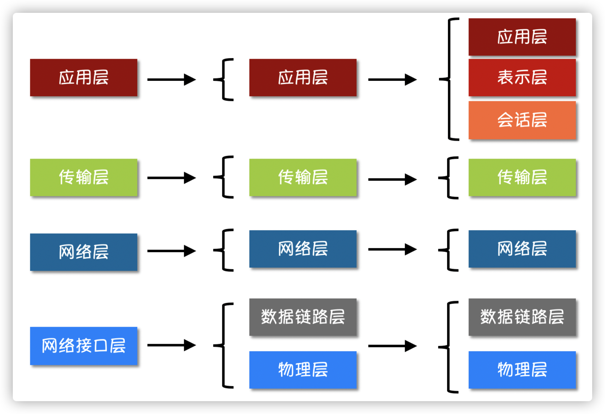
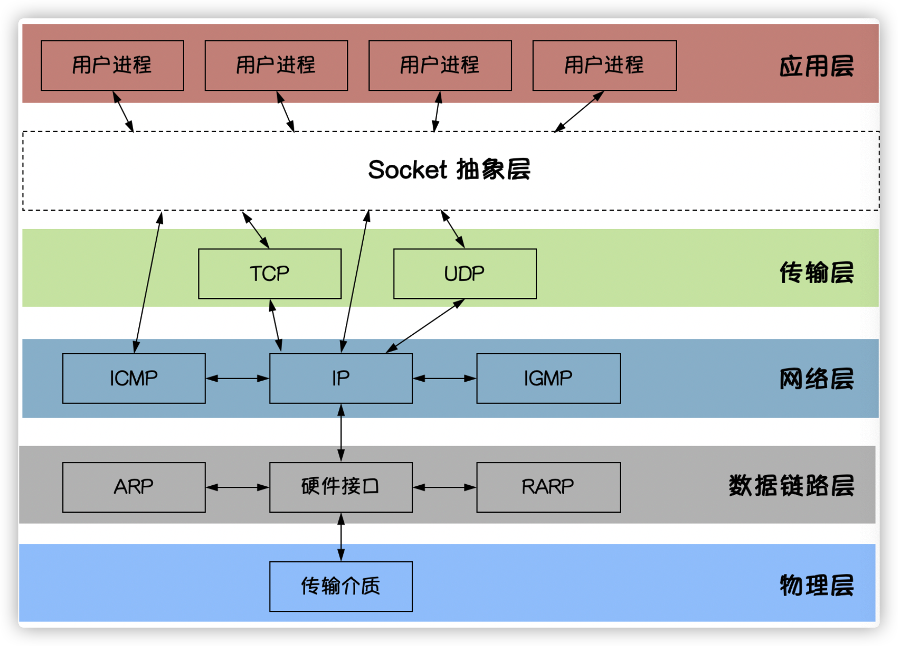

## 互联网协议

### 互联网分层模型




## socket编程

### socket图解

​	socket是unix的进程通信机制，通常叫套接字，用于描述IP地址和端口，是一个通信链的句柄。socket可以理解为TCP/IP网络的API，它定义了许多的函数和例程，可以利用它们开发TCP/IP网络上的应用程序。

​	socket是应用层与TCP/IP协议族通信的中间软件抽象层，socket是一个门面模式，它把复杂的TCP/IP协议族隐藏在socket里面，只需要调用socket规定的相关函数，就可以让socket去组织制定的协议数据进行通信。



### TCP编程

#### TCP协议

​	TCP/IP，传输控制协议/网络协议，是一种面向连接的，可靠的，基于字节流的通信协议，会存在粘包问题。

#### TCP服务端

```
1.监听端口
2.接收客户端求情创建链接
3.创建goroutine处理链接
```

```go
func main() {
	listen, err := net.Listen("tcp", "127.0.0.1:8081")
	if err != nil {
		fmt.Println("listen failed, err: ", err)
		return
	}
	for {
		conn, err := listen.Accept()
		if err != nil {
			fmt.Println("accept failed, err:", err)
			continue
		}
		go process(conn)
	}
}

func process(conn net.Conn) {
	defer conn.Close()

	for {
		reader := bufio.NewReader(conn)
		var buf [128]byte
		n, err := reader.Read(buf[:]) // 读取数据
		if err != nil {
			fmt.Println("read from client failed, err:", err)
			break
		}
		recStr := string(buf[:n])
		fmt.Println("收到client端发来的数据：", recStr)
		conn.Write([]byte(recStr)) // 发送数据
	}
}
```

#### TCP客户端

```
1.简历与服务端的链接
2.进行数据收发
3.关闭链接
```

```go
func main() {
	conn, err := net.Dial("tcp", "127.0.0.1:8081")
	if err != nil {
		fmt.Println("err: ", err)
		return
	}
	defer conn.Close()
	inputReader := bufio.NewReader(os.Stdin)
	for {
		input, _ := inputReader.ReadString('\n') // 读取用户输入
		inputInfo := strings.Trim(input, "\r\n")
		if strings.ToUpper(inputInfo) == "Q" { // 如果输入q就退出
			return
		}
		_, err = conn.Write([]byte(inputInfo)) // 发送数据
		if err != nil {
			return
		}
		buf := [512]byte{}
		n, err := conn.Read(buf[:])
		if err != nil {
			fmt.Println("recv failed, err:", err)
			return
		}
		fmt.Println(string(buf[:n]))
	}
}
```

### UDP 编程

#### UDP协议

​	UDP协议中文名是用户数据报协议，是一种无连接的传输协议，不需要建立链接就能直接进行数据发送和接收，属于不可靠的、没有时序的通信，但是UDP性能好。

#### UDP服务端

```go
func main() {
	listen, err := net.ListenUDP("udp", &net.UDPAddr{
		IP:   net.IPv4(0, 0, 0, 0),
		Port: 8081,
	})
	if err != nil {
		fmt.Println("listen failed, err: ", err)
		return
	}
	defer listen.Close()
	for {
		var data [1024]byte
		n, addr, err := listen.ReadFromUDP(data[:]) // 接收数据
		if err != nil {
			fmt.Println("read udp failed, err:", err)
			continue
		}
		fmt.Printf("data:%v addr:%v count:%v\n", string(data[:n]), addr, n)
		_, err = listen.WriteToUDP(data[:n], addr) // 发送数据
		if err != nil {
			fmt.Println("write to udp failed, err:", err)
			continue
		}
	}
}
```

#### UDP客户端

```go
func main() {
	socket, err := net.DialUDP("udp", nil, &net.UDPAddr{
		IP:   net.IPv4(0, 0, 0, 0),
		Port: 8081,
	})
	if err != nil {
		fmt.Println("连接服务端失败，err:", err)
		return
	}
	defer socket.Close()
	sendData := []byte("Hello server")
	_, err = socket.Write(sendData) // 发送数据
	if err != nil {
		fmt.Println("发送数据失败，err:", err)
		return
	}
	data := make([]byte, 4096)
	n, remoteAddr, err := socket.ReadFromUDP(data) // 接收数据
	if err != nil {
		fmt.Println("接收数据失败，err:", err)
		return
	}
	fmt.Printf("recv:%v addr:%v count:%v\n", string(data[:n]), remoteAddr, n)
}
```

### TCP粘包

#### 为什么会出现粘包

​	主要原因是TCP数据传递是流模式，在保持长连接的时候可以进行多次的收和发。

​	既可以发生在发送端，也可以发生在接收端。

```
1.由Nagle算法造成的发送端粘包：Nagle算法是一种改善网络传输效率的算法，简单来说就是一段数据给TCP发送时，TCP并不会立刻发送此段数据，而是等待一小段时间看看在等待期间是否还有数据要发送，若有则会一次把两段数据发送出去
2.接收端接收不及时造成的接收端粘包：TCP会把接收到的数据存在自己的缓冲区中，然后通知应用层取数据。当应用层由于某些原因不能及时的把TCP的数据取出来，就会造成TCP缓冲区中存放了几段数据。 
```

#### 解决办法

​	出现粘包的关键在于接收方不知道要传输的数据包的大小，因此可以对数据包进行封包和拆包的操作。

```go
// Encode 将消息编码
func Encode(message string) ([]byte, error) {
   // 读取消息的长度，转换成int32类型（占4个字节）
   var length = int32(len(message))
   var pkg = new(bytes.Buffer)
   // 写入消息头
   err := binary.Write(pkg, binary.LittleEndian, length)
   if err != nil {
      return nil, err
   }
   // 写入消息实体
   err = binary.Write(pkg, binary.LittleEndian, []byte(message))
   if err != nil {
      return nil, err
   }
   return pkg.Bytes(), nil
}

// Decode 解码消息
func Decode(reader *bufio.Reader) (string, error) {
   // 读取消息的长度
   lengthByte, _ := reader.Peek(4) // 读取前4个字节的数据
   lengthBuff := bytes.NewBuffer(lengthByte)
   var length int32
   err := binary.Read(lengthBuff, binary.LittleEndian, &length)
   if err != nil {
      return "", err
   }
   // Buffered返回缓冲中现有的可读取的字节数。
   if int32(reader.Buffered()) < length+4 {
      return "", err
   }
   // 读取真正的消息数据
   pack := make([]byte, int(4+length))
   _, err = reader.Read(pack)
   if err != nil {
      return "", err
   }
   return string(pack[4:]), nil
}
```

## HTTP

### web工作流程

​	WEB服务器的工作原理可以简单的归纳为：

- 客户机通过TCP/IP协议建立到服务的TCP连接
- 客户端向服务器发送HTTP协议请求包，请求服务器里的资源文件
- 服务器向客户急发送HTTP协议应答包，如果请求的资源包含动态语言的内容，那么服务器会调用动态语言的解释引擎负责处理“动态内容”，并将处理得到的数据返回值客户端
- 客户机与服务器断开，由客户端解释HTML文档，在客户端屏幕上渲染图形结果

### HTTP协议

- 超文本传输协议，HTTP，规定了浏览器和万维网服务器通信的规则，通过因特网传送万维网文档的数据传送协议
- HTTP协议通常承载在TCP协议之上

## WebSocket

- WebSocket是一种建立在单个TCP连接上进行全双工通信的协议
- 是的客户端和服务器之间的数据交换变得更加简单，允许服务端主动向客户端推送数据
- 浏览器和客户端只需要一次握手，就可以完成持久性的连接，并进行双向数据传输

> 第三方包
>
> go get -u -v github.com/gorilla/websocket

